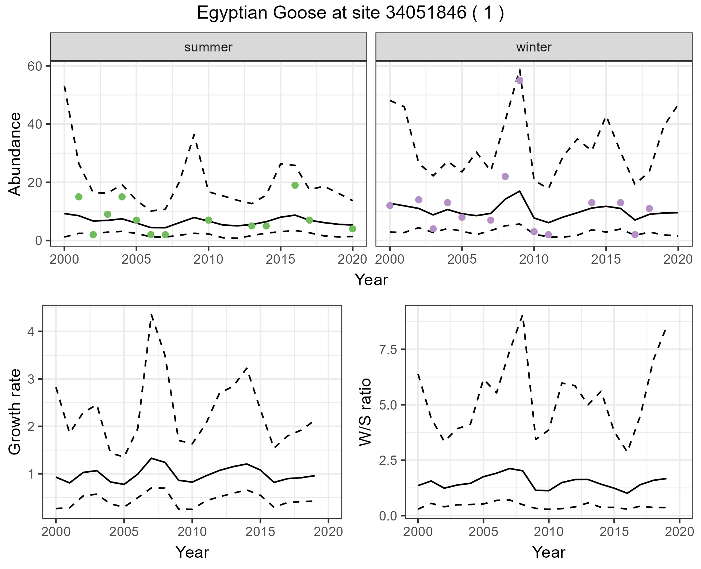

<!-- README.md is generated from README.Rmd. Please edit that file -->

# BIRDIE_abundance

<!-- badges: start -->

<!-- badges: end -->

## Project Description

The goal of `BIRDIE_abundance` is to set up a project to model the
abundance of a bird species using CWAC time-series data obtained using
the R BIRDIE package for the near-term ecological forecasting course run
by the African Chapter of the Ecological Forecasting Initiative,
Ecoforecast Africa (<https://ecoforecast.africa/>). See
<https://ecoforecast.africa/events/>.

## BIRDIE

The aim of the [BIRDIE
project](https://birdieapp.sanbi.org.za/birdie/mviewer/#) was to develop
a data-to-decision pipeline for wetlands and waterbirds in South Africa
that uses statistical analyses to compute policy-relevant indicators
using citizen science data. The data pipeline initiates pulling data
from different databases and repositories, data then moves through
cleaning and validation steps, and into statistical analyses and
summarises that result into indicators that are useful for decision
makers. These indicators are then post-processed and presented on the
BIRDIE website. These indicators are useful to support South Africa’s
national and international reporting requirements, management of wetland
sites, and broader interest in wetlands and waterbirds. We will only be
using abundance data collected as part of the Coordinated Waterbird
Counts ([CWAC](https://cwac.birdmap.africa/)) project. This is a
long-term project running since 1992 in which citizen scientists conduct
bi-annual counts of waterbirds at registered waterbodies

## JAGS

JAGS is standalone software that R will call using the package, rjags.
You need to manually install this from the [JAGS
website](https://sourceforge.net/projects/mcmc-jags/files/).

## R packages

We first need to install a few packages that are not available on CRAN
and only on GitHub.

``` r
# Install from GitHub
devtools::install_github("AfricaBirdData/BIRDIE")
devtools::install_github("AfricaBirdData/CWAC")
devtools::install_github("AfricaBirdData/ABAP")
devtools::install_github("mrke/NicheMapR")
```

Load all required packages

``` r
library(BIRDIE)
library(CWAC)
library(ABAP)
#> 
#> Attaching package: 'ABAP'
#> The following object is masked from 'package:CWAC':
#> 
#>     jsonToTibble
```

``` r
library(dplyr)
#> 
#> Attaching package: 'dplyr'
#> The following objects are masked from 'package:stats':
#> 
#>     filter, lag
#> The following objects are masked from 'package:base':
#> 
#>     intersect, setdiff, setequal, union
```

``` r
library(ggplot2)
library(stringr)
library(sf)
#> Linking to GEOS 3.12.1, GDAL 3.8.4, PROJ 9.3.1; sf_use_s2() is TRUE
```

``` r
library(futile.logger)
library(NicheMapR)
```

## State-space model example

We are going to use the example of the Egyptian Goose (*Alopochen
aegyptiaca*) at the Eerste River Estuary.

<figure>


<figcaption aria-hidden="true">

Egyptian goose (Wikipedia).

</figcaption>

</figure>

We will: 1. Get count data for this species 2. Preprocess the data to be
able to run a state-space model (SSM) 3. Get environmental covariate
data 4. Run an SSM either with or without covariates and plot model
predictions

### 1. Get count data for this species

In our first step we will get the unique identifiers for our species and
site of interest. We will then get the count data for our species at
this site.

``` r
# Get list of all CWAC species
spp_list <- listCwacSpp()

# Get ID data for Egyptian goose
genus <- "Alopochen"
sp_epithet <- "aegyptiaca"
sp_ID_dat <- spp_list %>%
  filter(Genus == genus & Species == sp_epithet) %>%
  slice(1)
sp_ID_dat
#> # A tibble: 1 × 11
#>   SppRef WetIntCode Odr         Family Genus Species Common_group Common_species
#>   <chr>  <chr>      <chr>       <chr>  <chr> <chr>   <chr>        <chr>         
#> 1 89     ALOAE      Anseriform… Anati… Alop… aegypt… Goose        Egyptian      
#> # ℹ 3 more variables: Ramsar_1_Level <chr>, GlobalIBA_1_Level <chr>,
#> #   SubRegional_IBA_05_Level <chr>
```

``` r
# Get species code
sp_code = sp_ID_dat$SppRef

# Get list of all CWAC sites in the Western Cape
sites <- listCwacSites(.region_type = "province", .region = "Western Cape")

# Select data for the Eerste River Estuary only
eerste <- sites %>% filter(LocationName == "Eerste River Estuary")
eerste
#> # A tibble: 1 × 31
#>   LocationCode LocationCodeAlias QDGC   LocationName     NearestTown CWAC_Status
#>   <chr>        <chr>             <chr>  <chr>            <chr>       <chr>      
#> 1 34051846     34051846          3418BB Eerste River Es… FAURE       REGISTERED…
#> # ℹ 25 more variables: Data_Ownership <chr>, RegisteredBy <chr>,
#> #   Province <chr>, Country <chr>, DateRegistered <chr>,
#> #   BriefDescription <chr>, PhysicalFeatures <chr>, HydrologicalFeatures <chr>,
#> #   EcologicalFeatures <chr>, ConservationStatus <chr>, ManagementStatus <chr>,
#> #   PAName <chr>, IBACode <chr>, RamsarCode <chr>, RamsarParent <chr>,
#> #   HeritageCode <chr>, Last_Updated <chr>, Area <chr>, X <chr>, Y <chr>,
#> #   Surveys <chr>, FirstSurvey <chr>, LastSurvey <chr>, LocationCode1 <chr>, …
```

``` r

# Download all counts for this site
bird_counts <- getCwacSiteCounts(eerste$LocationCode)

# Select data for species of interest only
sp_counts <- bird_counts %>% filter(Genus == genus & Species == sp_epithet)

# Visualise counts for species of interest
sp_counts %>%
  ggplot(aes(x = StartDate, y = Count)) +
  geom_line() +
  geom_point() +
  # labs(title = "Hourly Data",
  #      x = "Date",
  #      y = "Value") +
  theme_minimal()
```

<!-- -->

``` r

# Get pentad for Eerste River Estuary (this is just an easy way to get a "polygon" for our study site so that we can get environmental covariate data later)
pentads_wc <- getRegionPentads(.region_type = "province", .region = "Western Cape") #Get all WC pentads
pentad_id <-findPentadFromCoords(as.numeric(eerste$Y), as.numeric(eerste$X)) #Get ID for Eerste River Estuary
pentad_site <- pentads_wc %>% filter(pentad == pentad_id)
```

### 2. Preprocess the data to be able to run a state-space model (SSM)

We will add missing counts, give them dates based on the dates of
existing counts, remove data that weren’t collected in summer or winter
and add indexes for site, year and visit

``` r
# Prepare data for modelling
source("code/create_data_ssm_single_site.R") #Modified code from BIRDIE package
model_data <- create_data_ssm_single_site(sp_counts)
#> Adding missing counts and guessing dates for them
#> Preparing data for modelling: removing seasons other than S and W
```

### 3. Get environmental covariate data from [TerraClimate](https://www.climatologylab.org/terraclimate.html)

``` r
# Get years for which counts are available
years = model_data %>% 
  distinct(Year) %>% 
  arrange(Year) %>% 
  pull(Year)

# Get coordinates of site
coords = st_coordinates(st_centroid(pentad_site$geometry))

# Download climate data (takes a while)
# terraclim_dat = get_terra(
#   scenario = 0,
#   x = coords,
#   ystart = min(years),
#   yfinish = max(years)
# )
# # Write data to CSV
# write.csv(terraclim_dat, 'data/terraclim_dat.csv', row.names = F)


# Add TerraClimate data to model_data
# Read in TerraClimate data
terraclim_dat <- read.csv('data/terraclim_dat.csv')

# Add year and month to TerraClimate data 
terraclim_dat = as.data.frame(terraclim_dat)
terraclim_dat$year = rep(min(years):max(years), each = 12)
terraclim_dat$month = rep(1:12, times = c(max(years) - min(years) + 1))

# Extract month from date of observation (used to match to TerraClimate data)
model_data$month = str_extract(model_data$date, "(?<=\\d{4}-)\\d{2}") %>% as.numeric()

# Add TerraClimate data to model_data
model_data = 
  model_data %>% 
  left_join(
    terraclim_dat, by = c('year', 'month'))
```

### 4. Run an SSM either with or without covariates and plot model predictions

``` r
# If fitting a state-space model without covariates
source("code/ppl_fit_ssm_model_edited.R")
fit <- ppl_fit_ssm_model_edited(model_data, "code/cwac_ssm_two_season_mean_rev_jump.R")
#> `summarise()` has grouped output by 'site_id', 'year'. You can override using
#> the `.groups` argument.
#> [1] "Fitting state-space JAGS model at 2025-07-21 09:31:12.291508"
#> 
#> Processing function input....... 
#> 
#> Done. 
#>  
#> Beginning parallel processing using 3 cores. Console output will be suppressed.
#> 
#> Parallel processing completed.
#> 
#> MCMC took 0.221 minutes.
```

``` r

# Get model prediction data for plotting purposes
fit_stats <- BIRDIE::processJAGSoutput(fit, DIC = T, params.omit = NULL)
#> Calculating statistics.......
```

``` r

# Get model predictions ggplot object
p <- BIRDIE::plotJagsSsm2ss(fit = fit_stats, ssm_counts = model_data, linear = T,
                            plot_options = 
                              list(pers_theme = theme_bw(),
                                   colors = c("#71BD5E", "#B590C7")))
#> Warning: Removed 45 rows containing missing values or values outside the scale range
#> (`geom_point()`).
#> Warning: Removed 3 rows containing missing values or values outside the scale range
#> (`geom_path()`).
#> Removed 3 rows containing missing values or values outside the scale range
#> (`geom_path()`).
```

``` r

# Plot model predictions
ggplot2::ggsave(paste0('output/',sp_code,'/Egyptian_goose_ssm_nocovars.png'), 
                plot = p[[1]]$plot, width = 6.4, height = 5.2)
```

<figure>


<figcaption aria-hidden="true">

State-space model (with no covariates) predicted abundance for the
Egyptian goose at the Eerste River Estuary.

</figcaption>

</figure>

``` r
# If fitting a state-space model WITH covariates
source("code/ppl_fit_ssm_model_edited_covars.R")
fit_covars <- ppl_fit_ssm_model_edited_covars(model_data, 
                                       "code/cwac_ssm_two_season_mean_rev_jump_covars.R")
#> `summarise()` has grouped output by 'site_id', 'year'. You can override using
#> the `.groups` argument.
#> [1] "Fitting state-space JAGS model at 2025-07-21 09:31:28.791764"
#> 
#> Processing function input....... 
#> 
#> Done. 
#>  
#> Beginning parallel processing using 3 cores. Console output will be suppressed.
#> 
#> Parallel processing completed.
#> 
#> MCMC took 0.198 minutes.
```

``` r

# Get model prediction data for plotting purposes
fit_covars_stats <- BIRDIE::processJAGSoutput(fit_covars, DIC = T, params.omit = NULL)
#> Calculating statistics.......
```

``` r

# Get model predictions ggplot object
p_covars <- BIRDIE::plotJagsSsm2ss(fit = fit_covars_stats, ssm_counts = model_data, linear = T,
                            plot_options = 
                              list(pers_theme = theme_bw(),
                                   colors = c("#71BD5E", "#B590C7")))
#> Warning: Removed 45 rows containing missing values or values outside the scale range
#> (`geom_point()`).
#> Warning: Removed 3 rows containing missing values or values outside the scale range
#> (`geom_path()`).
#> Removed 3 rows containing missing values or values outside the scale range
#> (`geom_path()`).
```

``` r

# Plot model predictions
ggplot2::ggsave(paste0('output/',sp_code,'/Egyptian_goose_ssm_covars.png'), 
                plot = p_covars[[1]]$plot, width = 6.4, height = 5.2)
```

<figure>



<figcaption aria-hidden="true">

State-space model (with covariates) predicted abundance for the Egyptian
goose at the Eerste River Estuary.

</figcaption>

</figure>
